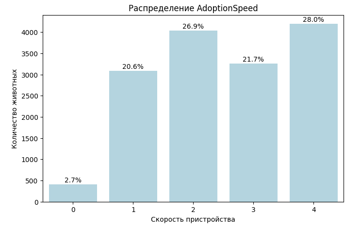
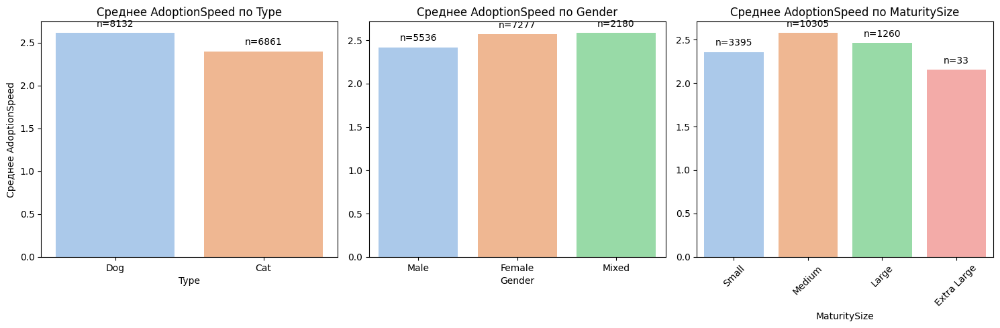
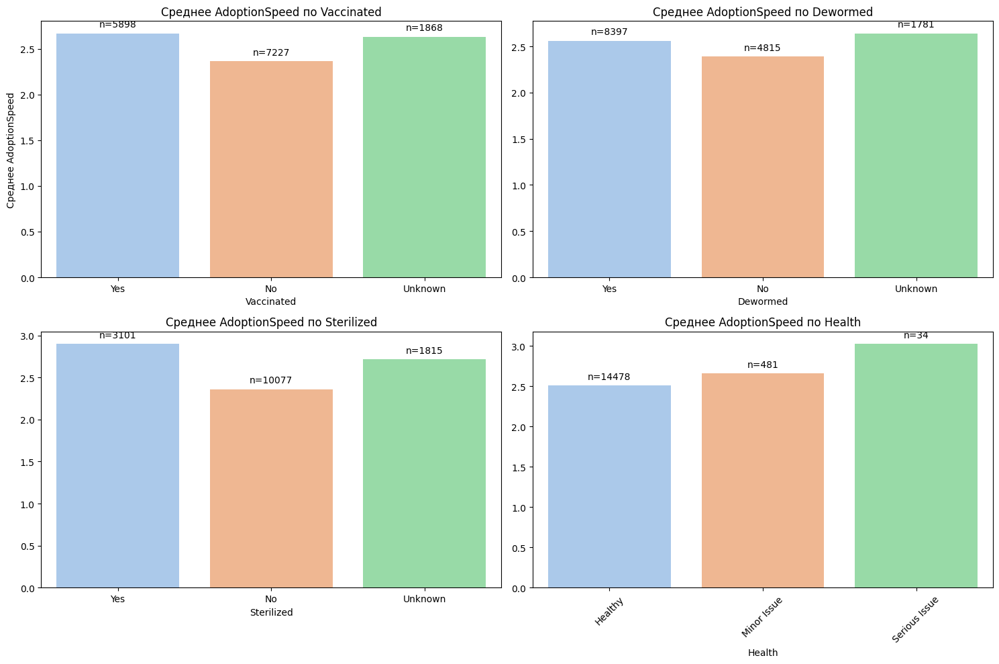
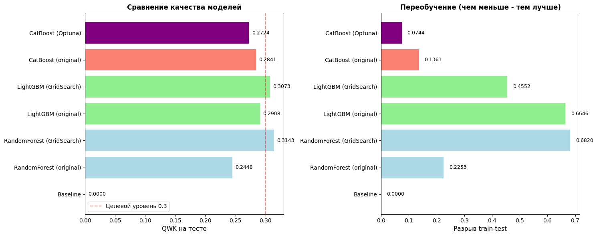
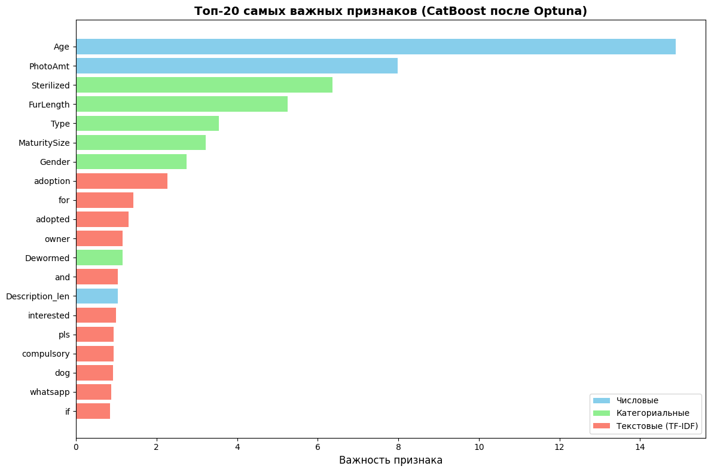
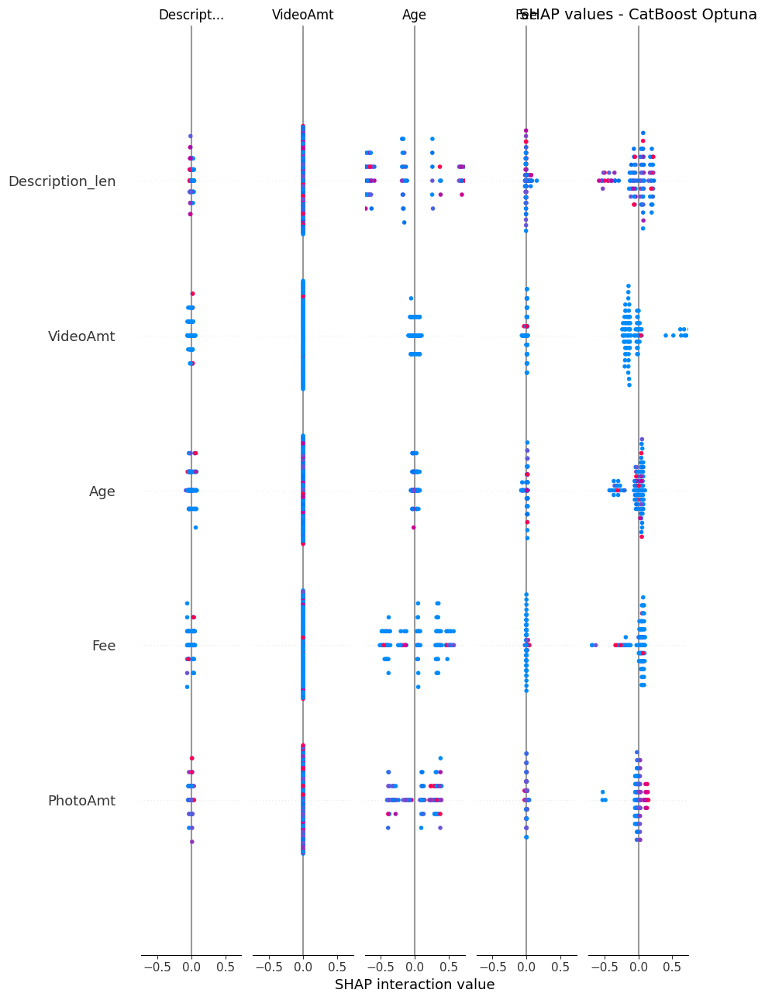

# Predicting Pet Adoption Speed Using Machine Learning

Дипломный проект по Data Science, посвященный анализу факторов, влияющих на скорость пристройства животных, и построению модели машинного обучения для прогнозирования категории Adoption Speed.

## Описание проекта

Цель проекта — исследовать, какие характеристики животных и объявления влияют на скорость пристройства, а также разработать модель классификации для прогнозирования категории Adoption Speed.

В рамках проекта проведен полный цикл работы с данными:
- исследование и подготовка данных;
- анализ факторов, влияющих на целевую переменную;
- построение и сравнение моделей машинного обучения;
- выбор наиболее стабильной модели.

## Данные

Использован датасет **PetFinder.my Adoption Prediction** с Kaggle:
https://www.kaggle.com/competitions/petfinder-adoption-prediction

Датасет содержит информацию о животных из приютов:
- возраст;
- порода;
- пол;
- состояние здоровья;
- вакцинация;
- стерилизация;
- количество фотографий;
- описание животного;
- дополнительные характеристики.

## Этапы работы

- Загрузка и изучение данных
- Очистка и предобработка данных
- Исследовательский анализ данных (EDA)
- Анализ пропущенных значений
- Feature Engineering
- Обучение моделей машинного обучения
- Оптимизация гиперпараметров
- Оценка качества моделей

## Используемые технологии

- Python
- Pandas
- NumPy
- Scikit-learn
- CatBoost
- LightGBM
- Optuna
- Matplotlib
- Plotly
- Jupyter Notebook

## Структура проекта
pet-adoption-analysis
│
├── diploma.ipynb
├── presentation.pdf
└── README.md
└── images
    ├── category_distribution1.png
    ├── category_distribution2.png
    ├── feature_importance.png
    ├── model_comparison.png
    ├── shap_analysis.png
    └── target_distribution.png

## Результаты моделирования

Для прогнозирования скорости пристройства животных были протестированы следующие модели:

| Модель | QWK test | Разрыв train-test |
| --- | --- | --- |
| RandomForest (GridSearch) | 0.3143 | 0.6820 |
| LightGBM (GridSearch) | 0.3073 | 0.4552 |
| CatBoost (Optuna) | 0.2724 | 0.0744 |

Метрика оценки качества модели — **Quadratic Weighted Kappa (QWK)**.

Несмотря на более высокий показатель QWK у RandomForest, модель показала сильное переобучение.

В качестве итоговой модели выбран **CatBoost с оптимизацией гиперпараметров через Optuna**, так как она продемонстрировала наиболее стабильную работу и минимальный разрыв между обучающей и тестовой выборками.

## Визуализация результатов

### Несбалансированность целевой переменной

### Распределение по категориям

### Сравнение моделей

### Важность признаков (CatBoost)

### SHAP-анализ

## Domain expertise

Проект дополнительно опирается на ветеринарную экспертизу, что позволило учитывать особенности признаков, связанных со здоровьем животных, вакцинацией, стерилизацией и породными характеристиками.
